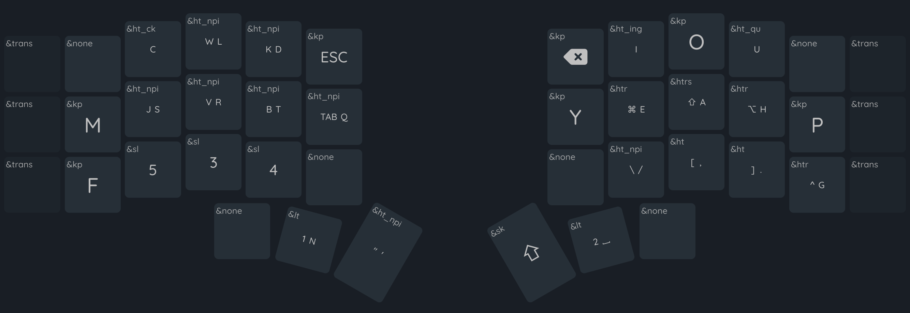
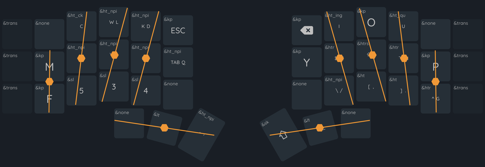
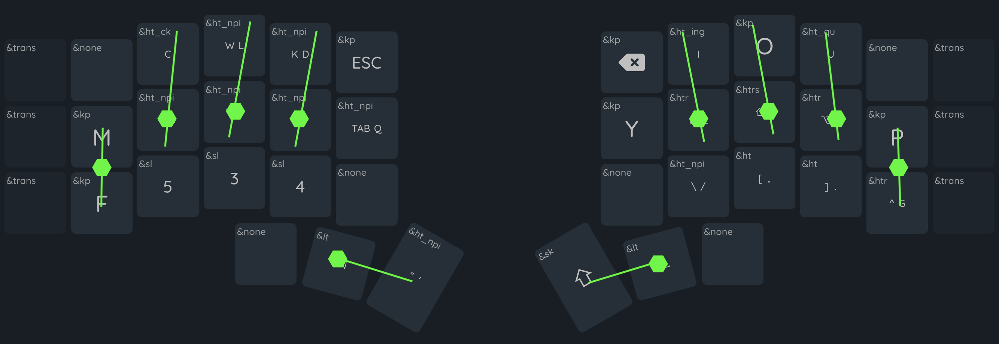
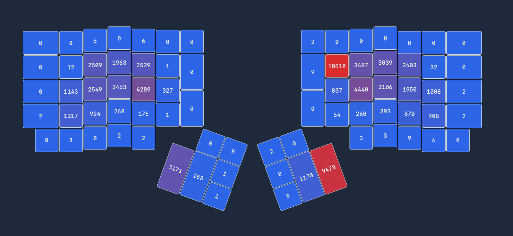
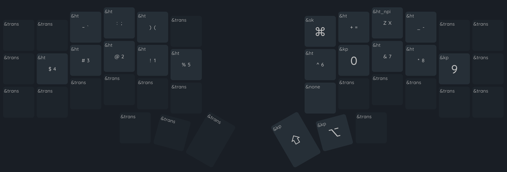
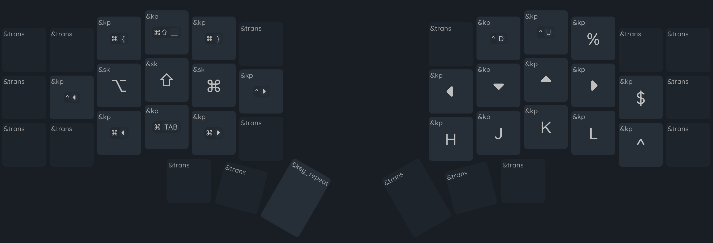
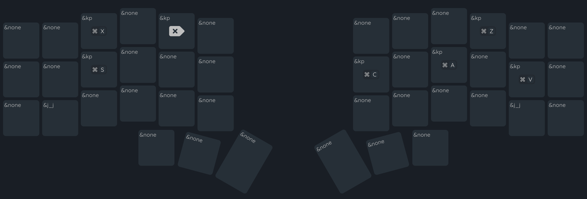
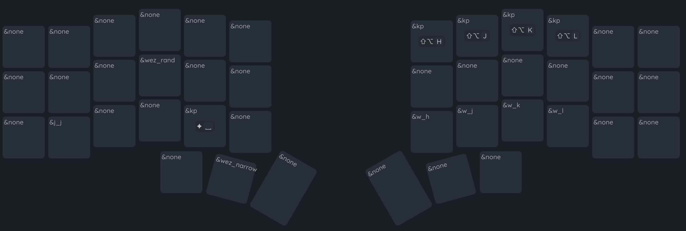
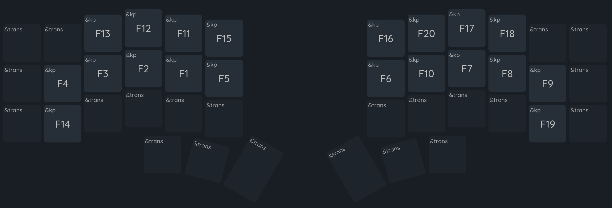

<html>
  <head>
    
  </head>
  

    
  

   
  
YEAH!

   
  

    <a href="https://configure.zsa.io/my_layout/view/q0aly">ZSA Oryx</a>
  

  

    <a href="https://my.glove80.com/#/layout/user/aa814603-8e2e-42e4-85dd-e3adc38ffd31">Glove 80</a>
  

  

    <a href="https://github.com/ryanfkeepers/zmk-config-corne/actions">Corne ZMK</a>
  

   
</html>
---

Delightful ergonomics with only 30 keys.  Designed for use with
keyboards like [hummingbird](https://github.com/PJE66/hummingbird)
and [tern](https://github.com/rschenk/tern), but usable on any ortholinear
keyboard.

## What this layout is

### Optimized for comfort

Do more typing with less reaching.  Less finger travel.  Fewer
stretches.  No pivoting at the wrist.  All those motions suck.  Typing
is my livelihood.  Maybe yours as well.  It's not supposed to suck.

This shows my natural typing position on any keyboard.  My arms and
wrists position along the keys to produce, effectively, a slight radial
deviation.  My ring and pinkie finger to straighten out, similar to the
splay you see on a
[totem keyboard](https://github.com/GEIGEIGEIST/TOTEM).
The lines show my natural reach without stretching or curling excessively,
and dots are the resting position of my fingertips.

"Excessive" reaching and curling is the problem with full size keyboards.
Not _my_ problem.  _The_ problem.  Most keys are only accessible by moving
your entire hand.  As far as I'm concerned, moving your hand is the worst
motion a typist can make.

Sure, not all of the reaches are painful. The number row, for example,
isn't a difficult reach for most people. But debating which rows are
better and which are worse turns this problem into a matter of degrees.
I'm not here to bicker over degrees.  I'm here to solve a problem.

Esc sucks.  Backspace sucks.  Modifier keys suck.  Tab sucks.  Return sucks.
Shift on the pinkies _really sucks_.  It's all bad.

Your keyboard (yes, even your fancy ergonomic one) has 30 reasonably
comfortable keys. Only 16 of them are truly good for frequent motions.
The rest cause discomfort, if not outright pain.

Here's what finger motion on YEAH looks like: two primary rows, minimum
travel.  No hand or wrist motions.  No ulnar stretches.  The tiniest bit of
radial deviation to reach the upper inner keys (your pointer fingers are
strong, they can handle it).

A fun side effect of two-row priority: the whole problem of scissor motions
(top-bottom, or bottom-top sequences, like `mi` on a qwerty layout) gets
eliminated by default.

How does it look in practice?  I have stats for that!

Yes, I press backspace a lot.

Side note: this picture shows an older version of the layout.  In this
version the `w` key was on the lower left ring finger (thus the ~900
presses), and the `k` was a long press on the upper middle.  The balance
works out much better with the current layout.

No, I don't have all the percentages on bigrams and rolls and redirects
and same hand counts and balance and jumbles and quansits and variable
hordenfloofers. Not because I don't want to.  Boy howdy am I a geek for
stats, and keyboard layouts are a game that I could minmax for eternity.
I didn't add those because it wouldn't be honest of me.

The applications that calculate layout efficiency stats don't know how to
handle a layout like YEAH. It lies beyond their ken.  I either have to run
them against a reduced dataset(ex: what are the stats if I, just, _ignore_
the letters `jxzbvwk`?), or I have to misrepresent the board (ex: let's
pretend z is the upper-right pinkie).

Here's what I think that analysis would tell you, if it could:

* lowish rolls
* highish redirects
* moderate single-hand redirects
* effectively zero scissors
* moderate single-finger bigrams
* minimum distance
* balanced finger and column usage

### Keep. It. Stupid. Simple

Alright, `stupid simple` probably gives it too much credit.  Still,
YEAH isn't designed to be fancy. A good keyboard layout needs to
do exactly two things: 1/ be useful and comfortable for everyday
actions, 2/ stay out of my way all the rest of the time (and that
includes taking up any extra space in my brain).

The overall experience is intended to feel minimalist.  Not just
in content, but in typing behavior as well.  These are the rules
I used to guide that design.

1. Prefer long-presses over layers, leaders, tap-dance, combos, sticky
keys, and etc.
2. If not a long press, use a layer.  But I only get two layers, max.
3. If not a layer, use the remaining tools left sparingly.

Why long presses?  Two reasons: they're difficult to trigger accidentally,
and they don't require any unexpected finger movements.  The only thing
they're bad for is typing speed- generally a non-issue here since the
letters and symbols I've added as long presses have low usage anyway.

### Vim friendly

I love vim.  Vim loves qwerty more than it loves me.  Painful truth.
Alternate layouts are, in general, notoriously bad for vim.  Event the
best ones provide little more than an apology and some suggestions
for workarounds.  Is YEAH any better?  Well... no.  Not on the alpha
layout anyway.  But since it's a fully configured layout the workarounds
are already built into the board.  Does that count?

For what it's worth: I use this layout with lazyvim out of the box.
No significant keybingdings, no reliance on specific cursor positioning
packages.  Ie: no bandaids.

Vim navigation aides are all in one spot: right hand, layer two. Besides
the standard `hjkl` and arrow keys I've added my favorite motions: pg up
and down, jump to start/end, and matching bracket.  If these aren't _your_
favorites, that's great!  They're just starting points.  There's plenty
room to play around and optimize to your preferences.

### English and Mac optimized

All you polyglots: I envy you.  I truly do.  English is all I have.

My sisters and brothers in linux, I love you all.  The man pays me to
work on a mac.  Therefore, I spend my energy optimizing for mac.

Windows... I acknowledge that you exist.

## What this layout is _not_

### Optimized for speed

Other layouts have won that race already.  Very smart layouts, with
solid ergonomics.  If that's what you're after you should check one
of those out.

So, how slow is it?  Let's put it this way: you'll feel slower than
normal.  That's the nature of long presses.  They require you to interrupt
your finger tempo at irregular times.  That alone is going to drive people
away from the layout.  To be fair, I don't blame them.  Acclimating to
irregular rhythms felt weird for me, too.  Not that I'd ever want to go back
now that I'm used to it.

### Pinkie-free

Pinky use can make or break a layout for some.  Those with weak or
misbehaving little digits, in particular. I don't mind using my pinkies,
so I let them carry their weight.  It's not _too_ much.  They're
still teeny tiny fingers after all, and don't like working.  But
it was that or put more keys on the bottom row, and I have my priorities.

Turns out (for me, at least) pinkies really don't mind tapping.  They just
hated all the stretching.  All the shifting and entering and tabbing and
such. Regular keys?  Not so bad.

### A drop-in on every keyboard

Column staggered and laptop keyboards don't take well to YEAH in particular.
I tried making it work with kanata and my laptop keyboard.  Two keys per
thumb is critical, and the irregular staggering between hands makes the
left hand awkward something terrible.

## Let's dig into the details

All the ink I'm about to spill below is for me to blog about the tiny
decisions within the layout.  I've already done what I can to sell you on
using it. If that didn't succeed... well, we can still be friends, right?

### Layer 1: Alpha

#### etoain shrldu

The 12 most common key placements took their inspiration from contemporary
layouts and were, honestly, the most boring park of the design.  You have
12 ideal keys across the home and upper rows (8 and 4 keys, respectively).
The important keys fit neatly into those spots, and my predecessors have
long ago wrung out most optimizations from those configurations.

`snrtld` on the left home and top row (ish; we'll talk `n`` later).  Vowel
cluster on the right home and top.`c` and `h` to the left and right,
respectively (these two trade back and forth on every othhe layout).
All a very standard foundation. It's really pretty difficult to go wrong
with the arrangement at this point.

`h` is probably the biggest deviation from the norm so far.  Most layouts
prefer it on the pointer finger.  It gives words beginning with `the-`
and `tha-` a nice left-to-right roll.  However, it also rolls towards the
pinkie, and takes a vowel off of the pointer, neither effect sparked joy.
I like the pinkie-h, with its inward rolls, much better.  Except that
it was too much usage for my pinkies.  The ring-finger gave the best of
both in trade for some single finger bigrams.  A net positive in my book.

`n` on the thumb is the other oddity.  Popular opinion says I should have
put `t` or `r` in that spot; or maybe `e`.  I don't have a strong opinion
in this case.  And, in fact, tried them all out during the testing process.
`t` and `r` felt like an equal swap, with `t` feeling the worse of the too
(too much usage for my preference).  As far as I'm concerned, they're
interchangeable.

#### qxzjk

Here's a more interesting topic: what to do with the _least_ used letters
(`qxzjk`). Like a sane person, I started by offering them to the worst
keys, like the upper pinkies and the lower pointers.  That taught me a
valuable lesson: it doesn't matter how rarely you use a key.  If it sucks,
it sucks, and you'll hate that you put it there.

`x` and `z` ended up as the only alpha keys on a different layer, because
they really, truly don't matter and just needed to go somewhere. `j` was
one of the first long-press keys I tried out- before truly committing to
their use; it bounced around as a long press under ten other letters
before merrily settling in beneath `s`.  `k` followed shortly after.

`q` is the most interesting of the set.  Despite being a nearly ignorable
letter, it has two peculiar problems.  First, it matters where you put it
in relation to `u`, which nixes a lot of otherwise sensible dumping grounds.
Second, it's a very commonly used hotkey.  Especially in vim.  It probably
could have lived a happy little life on the second layer or as a long-
press, but I'm more content with it on the top layer.  Knock-on effect, the
current position (inner left home row) prevents me from putting a more
frequently used character in that spot (like what I tested and hated
with `w`, `g`, `f`, and `c`).

#### cmwfgypbv

Most of effort I put into refining the layout went into the
not-quite-useless letters, with frequency ranging from 3.3% (`c`) to 1%
(`v`). 1.6% appearance (as in the case of `w`) doesn't sound like much.
But that's where the stats can turn against you.

First: letter frequency is not word frequency (ex: who would want what we
wish for, anyway?).
[9 of the 50 most frequent words](https://norvig.com/mayzner.html)
in english begin with `w`.  Second: letter frequency is not n-gram frequency.
`ing` is the third most used trigram, behind `the` and `and`. Which is all
to say: there's no such thing as letter you can ignore in placement.
Except, perhaps, for z.

#### Bear with me for a short digression

Ben Vallack's [16 key insanity](https://youtu.be/5RN_4PQ0j1A?feature=shared)
is the spark that started this project. It's not that I wanted to do
anything so audacious.  But if it could work at all, and it really
looks like it's working for him, then there must be _something_ in the
design that I could learn from, right?

The more time I spent refining the layout through trial and error,
the more I loathed the bottom row.  It didn't really matter which keys
went there; whether they were common or rare, how completely
I removed scissors or sfbs, if those letters always rolled or alternated.
Bottom row usage always chafed. For the longest time I thought the problem
was that I balanced bigrams poorly or was blind to bad alternates. It
took me a long time to realize the problem was, well, me: my fingers all
like to do the same thing at the same time.

When I extend one finger, they all like to extend.  When I curl one, they
all like to curl.  Maybe your fingers aren't cabled the same way.  Have you
ever tried to curl your pinkie to see if your other fingers also curl?
That happens when I curl any finger. Translated to
typing it means that whenever any one finger dropped to the bottom row,
all my other fingers wanted to follow it.  Jumping from the top to bottom
rows always involved all my fingers.  Same-finger-skip-bigrams are more like
four-finger-skip-bigrams.

#### cmwfgypbv and long-presses

In the end I looked back to Vallack for the solution: two rows to hold
all of the alphabet.  Can't have skip row problems if my fingers never
skip a row, right?

`mpfg` became my pinkie bffs.  They're less suitable for long
presses, being on the higher end of usage in this letter set.  More
importantly they don't frequently bigram with any of their adjacent
ring finger letters, or with each other.  The result is a lot of
alternating hands and rolling to and from to the middle and pointer
fingers.

`wvb` won the long press lottery, alongside `jk`.  `w` is probably the
most debatable of the bunch.  I gave it a lot of time to fight `g` for
a spot on the pinkie. Ultimately `g` won thanks to `h`.  The `wh` bigram
wasn't a good feel.  (side note: jury is still out on whether `g`
should switch `p` to avoid `gh` for the same reason).

#### Odds and ends: combos, qmk, and zmk

`return` reigns as the only surviving combo, placed  on `iu` (upper right
pointer and ring fingers).  I formerly had escape on the left hand in
the same position, and the symmetry felt nice.  The overall lack of
combos (I know many people who swear by them) is driven by two issues: 1/
QMK doesn't support a combo and a tap-dance (ie: long presses) on the
same key.  That cripples just about every option I have.  2/ I don't like
combos at all- too much interference, cognitive load, and finger
contortions.

ZMK allows for a much richer set of functionality, including macros on
a long-press.  This allows me to add in some minor efficiencies that make
my life a couple degrees more pleasant: `ck` on `c` (they're often paired,
and `k` would be a long press anyway) and `qu` on `u` (prevents me from
reaching for `q`). I do have `ing` on `i` at the moment, but have largely
ignored it of late, now that my hands have adjusted to the layout.

### Layer 2: Numbers

#### Don't promote symbols

The most common problem I see in layer design is the "everything needs
its own key" trend.  Every symbol, especially.  It's a massive waste of
ten valuable keys, and usually results in an entirely new layer.
The symbols on the number keys are plenty available, provided you have
access to a shift key (or even an OSM shift, or a long press).

Parentheses are the exception that proves the rule.  As one of the most
highly used brackets in both programming and writing, their number-bound
position is ludicrous.  YEAH pulls a trick that I don't see elsewhere
by binding both to the same key as short and long presses.  In my experience
this tends results in far less long-pressing than you might imagine, due
to IDEs auto-pairing opening brackets.

#### How 'bout them numbers

What's with the number ordering?  Half of it comes from
[Benfords Law](https://en.wikipedia.org/wiki/Benford%27s_law).
The other half from not taking Benford's law too far.  It really is nice
to use the pointer finger for most of the number pressing.  If I really
wanted to maximize that balance I could take it one more step and
try something like odds-left-evens-right.

I chose the current layout by wanting to make the smallest possible change
while still putting `1` and `0` on my index.  At first I tried to only move
those two keys, but realized I'd shifted `2` to the pinkie instead of `1`,
with many of the same impacts.  Flipping `1234` brought everything to a
"good enough" state.  Since I don't type all that many numbers, I haven't
looked back.

### Layer 3: Vim & Nav

#### Vim nav (right hand)

The arrow keys and `hjkl` are pretty self explanatory.  I'd love to pare
it down to the arrows and swap the lower four for `b<^d><^u>w`, but vim
packages have inconsistent behavior when it comes to prioritizing arrows
and `hjkl` making it difficult to unify without getting into a
tangle of reconfiguration (ironically, a tangle I generally try to avoid).

The rest are my favorite positioning hotkeys.  Page ups/downs, start/end
of line, bracket pairs.  There's a little leak onto the left hand with
the curly brackets.  They aren't there for brackets; I have the alpha
layer for that.  I use these ones for jumping whitespace.  When I remember
that they exist, anyway.

#### Os nav (left hand)

Calling this the 'left hand' part is a bit of a cheat, since I still use
the arrow keys all the time to navigate in my os.  The modifier keys on
the left home row are the game changer, and makes non-vim cursor
positioning all kinds of comfortable.

The last three buttons are the only os navigation hotkeys I frequently
use: tab hopping, and the [homerow](https://www.homerow.app/) hotkey.
All the other navigation hotkeys are either sufficiently accessible (one
of my other standards: don't add hotkeys for anything I don't use at
least a couple times a day), not part of my personal routine, or handled
by other programs like [aerospace](https://github.com/nikitabobko/AeroSpace).

### Layers 4-6: Leader layers

#### You said two layers, max

Yes, I did, and I still stand by that.  The number and vim layers are the
only true "layers" (which I will now define as, "separate key layouts that
get toggled off and on for extended periods of use").  These three are a
layer-based hack for making [leader key](https://docs.qmk.fm/features/leader_key)
kinds of sequences.

Why not use _actual_ leader key support?  Most simply, because my ergodox-ez
doesn't support them, and I like to maintain as much parity between my
keyboards as possible.  On the more technical side, there's two ways to
map out leader key sequences: by position (ie: which key to press) or by
value (ie: which letter to press).  Both are equally valid.  For YEAH I've
prioritized the former, which fits more easily in the many-layers hack
than the proper leader-key design.

#### Common meta-actions

With `zxv` getting placed so far out of the way, common actions like
undo and cut get unnecessarily difficult to reach.  This leader patches
that up by bringing the actions into easier access.  Half of the hotkeys
match their os location (save, select all), while the other half match
their vim keys (undo, yank, cut, delete).

#### Window actions

This layer is provides hotkeys for two sets of actions that otherwise
require too much piano fingering.  The top row on the right hand positions
windows around the screen in aerospace.  The bottom right row moves the
vim cursor to an adjacent window.

On the left side are a couple hotkeys that I've set up for personal use in
wezterm.  I don't honestly expect them to make sense by anyone else.  I'm
also too lazy to move them for this display.

#### Fn keys

I honestly don't use them much.  But, hey, they serve a purpose... right?

## Thank you for reading

Seriously, you're awesome.  I appreciate you.
